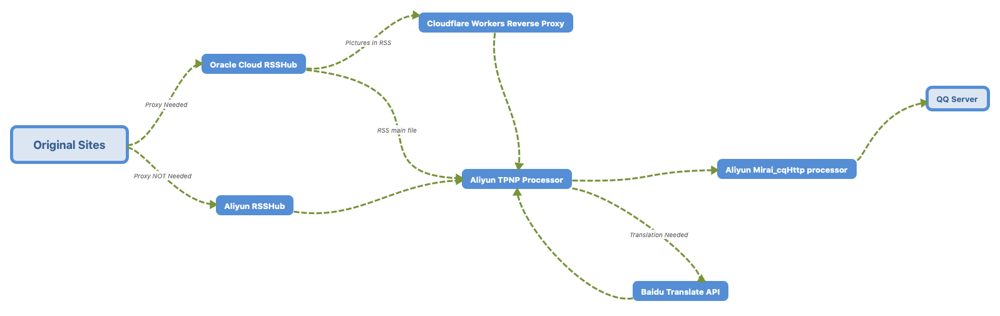

# TPNP for Mirai

## IMPORTANT: GDPR

[Click Here.](GDPR)

## Welcome to TPNPforMirai Site

TPNP -- Tamaki Polka Notification Pusher

Please, check out code repository's `README.md` before opening an issue, thanks!

## Latency Test

TL;DR: VERY FAST

Usually process data within 120s, with drop rate of 5% - 10%.

Here's the structure:



## Todo List

```Markdown
Network Error Workaround
Autorestart on Exception
```

## Original Repositories

[cqhttp-mirai](https://github.com/yyuueexxiinngg/cqhttp-mirai)

[Quan666/ELF_RSS](https://github.com/Quan666/ELF_RSS)
