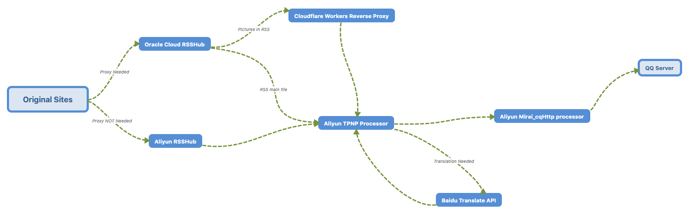

# Latency Record

## Overview

Note: RSSHub seems blocked on AliyunLightServer.

## Calculated Data

| Date | Processed Requests | Average Latency |
| :----: | :----: | :----: |
| 2020-08-18 | 15 | 41.23s |

## Raw Data

### 2020

#### 08/August

##### 18

| No. | Published Time | Processed Time | Latency |
| :----: | :----: | :----: | :----: |
| 1 | 20:54:58 | 20:55:59 | 61s |
| 2 | 20:55:41 | 20:56:00 | 19s |
| 3 | 20:57:09 | 20:57:58 | 49s |
| 4 | 21:00:36 | 21:01:37 | 61s |
| 5 | 22:01:26 | 22:01:56 | 30s |
| 6 | 22:34:15 | 22:34:19 | 4s |
| 7 | 22:40:06 | 22:41:44 | 98s |
| 8 | 23:00:10 | 23:00:58 | 48s |
| 9 | 23:00:47 | 23:02:39 | 112s |
| 10 | 23:09:36 | 23:09:42 | 6s |
| 11 | 23:13:43 | 23:13:54 | 11s |
| 12 | 23:13:26 | 23:13:54 | 28s |
| 13 | 23:19:00 | 23:19:57 | 57s |

| No. | Published Time | Processed Time |
| :----: | :----: | :----: |
| F1 | 16:02:16 | 21:23:09 |
| F2 | 23:16:46 | 23:27:41 |
